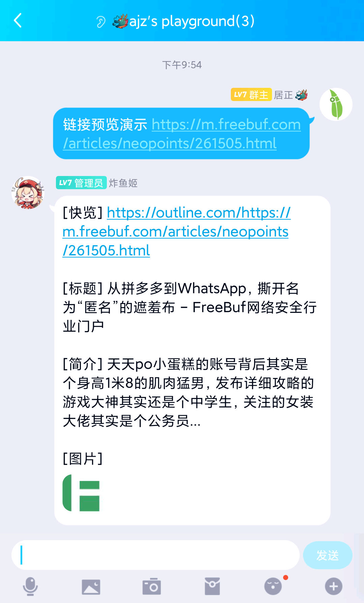
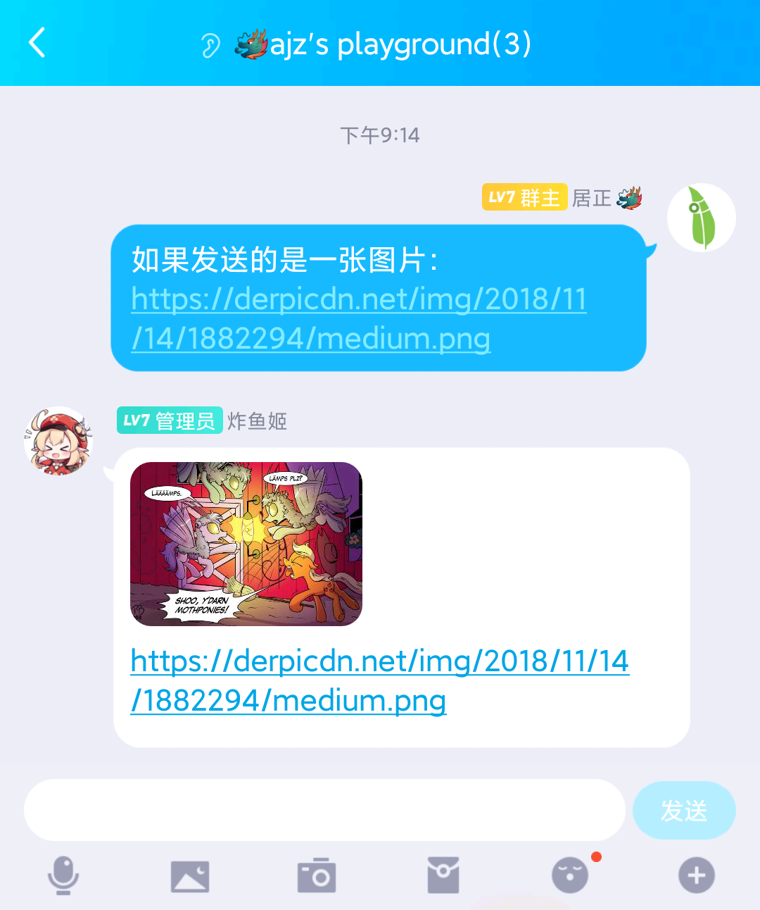
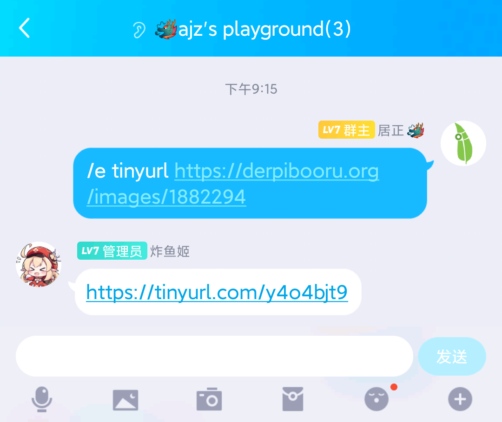
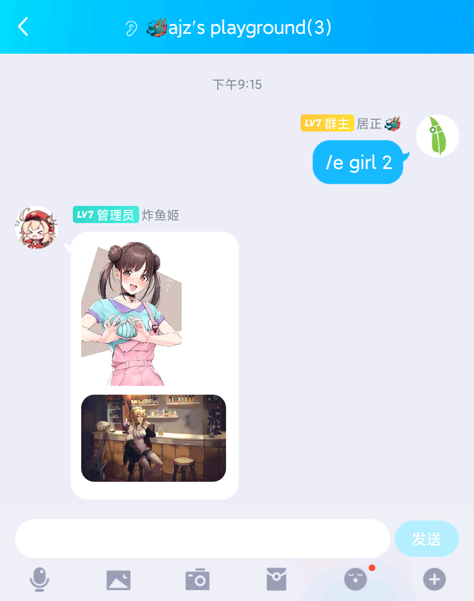

# QQ Group Enhancement Bot

一个基于Mirai QQ机器人框架，为QQ群组提供网址链接预览、不限时消息撤回、不进群也能浏览消息等增强型功能的mirai-console插件，致力于让QQ群的体验更像Telegram群组。

## 使用

1. 根据[mirai-console文档](https://github.com/mamoe/mirai-console/)部署机器人框架，配置登录用户并运行一次。

2. 在[Release](https://github.com/juzeon/QQ-Group-Enhancement-Bot/releases)中下载最新本插件的`jar`包，放入`plugins`文件夹。
3. 再次启动mirai-console即可。
4. 您可以打开`config/QQ-Group-Enhancement-Bot/config.yml`，根据注释对插件进行相应配置。

## 功能

#### 网页链接预览：



#### 图片链接预览：



#### 短网址：



#### 随机二次元图片：



## 目前支持的指令

```
QQ-Group-Enhancement-Bot 命令帮助（/e 命令帮助）
/e - 显示本帮助
/e tinyurl <url> - 使用 tinyurl.com 缩短网址
   eg. /e tinyurl https://github.com/juzeon/QQ-Group-Enhancement-Bot
/e girl <count> - 获取二次元图片，count不填默认为1
   eg. /e girl 6
```

## TODO List

- [x] 网址链接预览
- [ ] 通过指令不限时消息撤回
- [ ] 生成不进群浏览消息的网页
- [ ] 管理员通过机器人匿名发送消息

